.. _scenario-label:

=========
Scenarios
=========
-----
About
-----

Hunter is always run with a specific ``Scenario``, which defines:

* the area
* availability of e.g. Tanker, AWACS, GCI
* location of static targets like bunkers, SAMs
* networks for helicopters/drones, ships, vehicles
* the number of moving targets like helicopter/drones, ships, vehicles
* IFF and Data-Link codes
* Which types of targets might shoot at you

Each scenario also defines a "typical airport". Note that you cannot be sure that the typical airport or any airport in the area is a safe place.

---------------------------
Information about scenarios
---------------------------

Whoever runs Hunter should announce, which scenario is used. Alternatively, if Hunter is run with flag ``-x 1`` then the details about the current scenario is available in Hunter's web application by choosing the current scenario/session in the `list of available sessions <https://hunter-web-ui.azurewebsites.net/ongoing_session/sessions_list>`_. Click on the relevant link for the session and you will see session details, amongst others:

* the MP-server to choose
* whether targets might be shooting at you
* an overview map with airports

From there you also get access to more menu items at the top. The information is session specific and also kept for some days after the session has ended.

--------
Examples
--------

Northern Norway
+++++++++++++++

A scenario around `ENNA <https://en.wikipedia.org/wiki/Lakselv_Airport,_Banak>`_ in the very North of Norway with fjords and ships and all. Lots of bombing targets and enough terrain changes to make hunting a bit interesting if you fly fast and low.

In the map below ships are sailing along the green lines, helicopters are flying along the red lines and static targets are place within the lila areas.

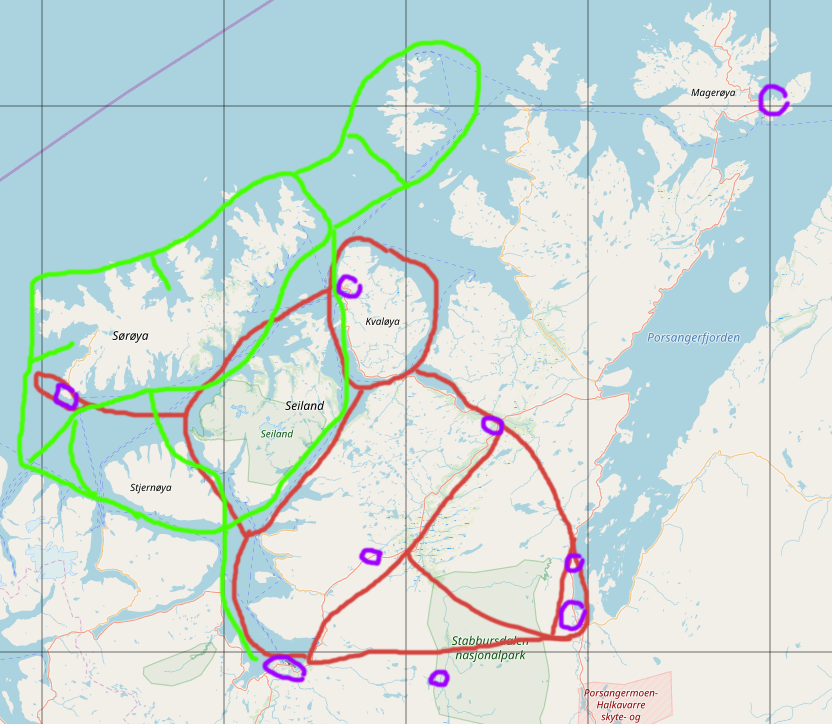

There might also be an aircraft carrier available sailing in the North-West corner of the map. Additionally, there could be a tanker available in the same area, flying in a pattern from north of Arnøya North-North-East ca. 40 nm and then returning back on FL120.

Swiss Shooting Ranges
+++++++++++++++++++++

Axalp
*****

The `Swiss Air Force <https://en.wikipedia.org/wiki/Swiss_Air_Force>`_ has a real shooting range at ca. 2200 metres above mean sea level in the Alps near `Meiringen airbase (ICAO: LSMM) <https://www.vtg.admin.ch/en/organisation/kdo-op/air-force/flpl-mei.html>`_ on `Axalp <https://en.wikipedia.org/wiki/Axalp#Fliegerschiessen_Axalp>`_ (Ebenfluh). There are plenty of videos and pictures on the internet to give you an impression about the spectacular scenery. The `core area <https://www.openstreetmap.org/node/305235603#map=14/46.6985/8.0744>`_ is between the Axalphorn and the Schwarzhorn.

There are 3 red shooting targets (ca. 10 m * 5 m) for cannons, 2 of which can also be used with rockets (not the one at "Axalphorn" in north direction).

The Swiss Air Force has an exercise "EK03", which previously was called "Kleeblatt" (cloverleaf, shamrock) as the flight path is looking like it. Due to tight turns and significant height differences most parts are flown with afterburner. The speed should never be below 320 kt and at the point of shooting should be up to 450-500 kt. Only during the 2-3 seconds of cannon fire there is a stable flight path. A detailed description can be read in [1]_, [2]_ and [3]_ (see manipulated pictures from the book below).

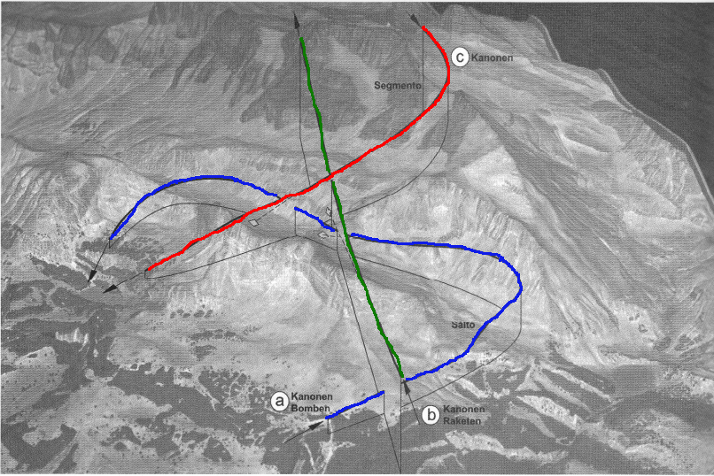

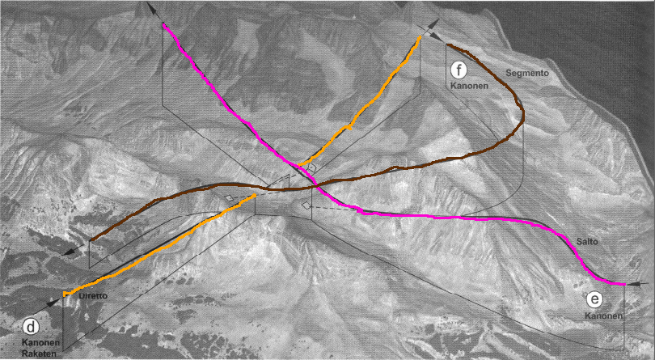

You start from LSMM, fly west to the lake "Brienzersee" and gain height to ca. 7500 ft while flying along the lake towards the town "Interlaken" until you have enough height, speed and your cannon is ready to fire. Finally turn left and fly North-East towards the valley between the "Axalphorn" and the "Schwarzhorn" mountains. You fly through the vally, do not shoot on the target, pass the command tower (on your left side) while flying over the "Grätli" (ridge) and then turn sharp to left between the "Axalphorn" and the "Oltschiburg" peaks in order to dive into the "Urserli" valley in north direction.

Flying the following 6 phases takes ca. 3 minutes depending on the fighter aircraft and skills.:

A. **(blue)** Fly a somewhat continuous 270 degree left turn along the mountain side gaining height while double checking that your cannon is ready. You get into the same valley as before, but this time you shoot a short burst against one of the two targets just under the ridge (preferably use the left target). Fly again over "Grätli" and dive into the "Urserli" valley.
B. **(green)** Fly a larger left turn this time, such that the flight path ends east-south-east and leads a bit to the left of the command post directly against the target in the cliff. After a short burst pull up to be able to gain height quickly and roll over the ridge (ca. 9000 ft).
C. **(red)** Dive a bit and turn right 180 degrees while gaining height again to fly in north direction towards the peak of "Schwarzhorn". To the left of the peak there is a gap, through which you fly north and then dive towards the second target near "Axalphorn". Pull the trigger, raise the nose a bit and show off by rolling left onto the back and dive over the ridge, roll 90 degrees and try to fly a bit east towards the airport.
D. **(amber)** Make a sharp 210 degree turn left towards the mountains and then over the lake and gain height immediately, so that you are at least at 7500 ft and can see the third target on a cliff (in FlightGear just a steep mountain side) while flying over the ridge between "Axalphorn" peak and the command tower. Shoot a burst and then immediately start a steep climb to roll over the ridge to the right of "Schwarzhorn" (same gap as used in the pass before in the other direction).
E. **(pink)** Make a large right turn while gaining height to cross the ridge near "Grossenegg" peak (ca. 3 km to the left of "Schwarzhorn") in north-east direction. You might shortly see the command post, but keep turning right and dive to hide a bit - just to pull up again and along a mountain side turn right into the valley with the first target. As soon as you see the first target (preferably the one on the right side) you need to aim and shoot. Continue in a soft long right turn towards north-east to fly around the "Garzen" peak.
F. **(brown)** Keep turning to the right in a large bow around the "Schwarzhorn" and fly north-north-east to the left of the "Grossenegg" to finally dive towards the target near "Axalphorn", shoot and roll over the mountain. From there you can start over at A.

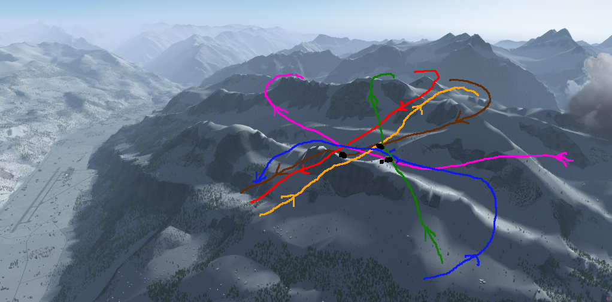

Carry just enough fuel - but else get rid of all other weight like missiles and stuff. It takes practice to get it right and you will have to remember the geometry of the flight path and of the mountains. Imagine a spotter near the targets: the less seconds she would see you, the better landscape cover you have, which is what you need in a war scenario.

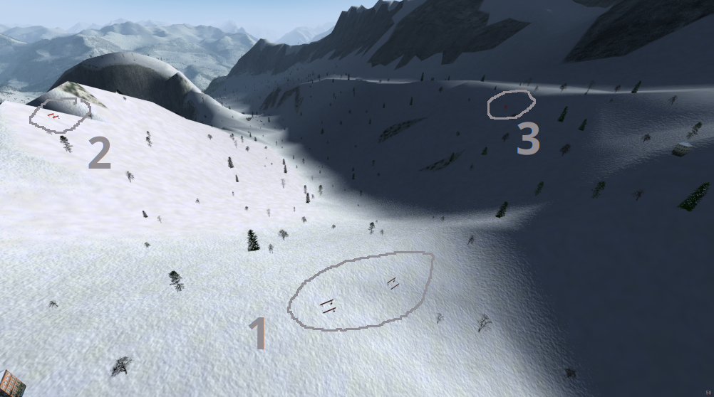

Dammastock
**********

Ca. 8 nm South-East of LSMM lies the ``Dammastock`` peak in the middle of a mountain and glacier landscape, which is surrounded by 4 pass roads.

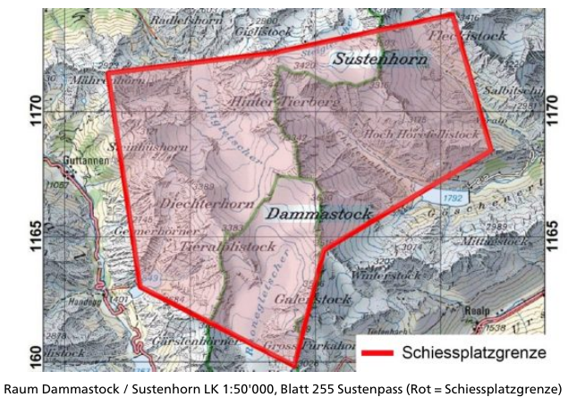

There are 2 Pilatus PC-9 towing an orange target in a distance of 500 metres from the plane on FL120 (in real life FL140) while flying in a circle with a diameter of 10 km around the peak. Simulated attacks can be flows along the whole circle, however shooting is only allowed in the zone from ca. 6 o'clock to 9o'clock (see picture).

Most often 2 modes of attack are flown:

* Flying on an elevated larger circle than the towed target and then dive down from out-side in (called "Avanti").
* "Butterfly": first fly against the towing plane and then fly a curve with pull-up/pull-down to hit the target from the front/side.

Apart from hitting the target and narrow landscape, timing is the biggest challenge.

You can also use the towing planes to train air policing slow targets.

Forel
*****

Ca. in the middle of the East shore of the Lake of Neuchâtel there is a target in the water close to the village of ``Forel``.

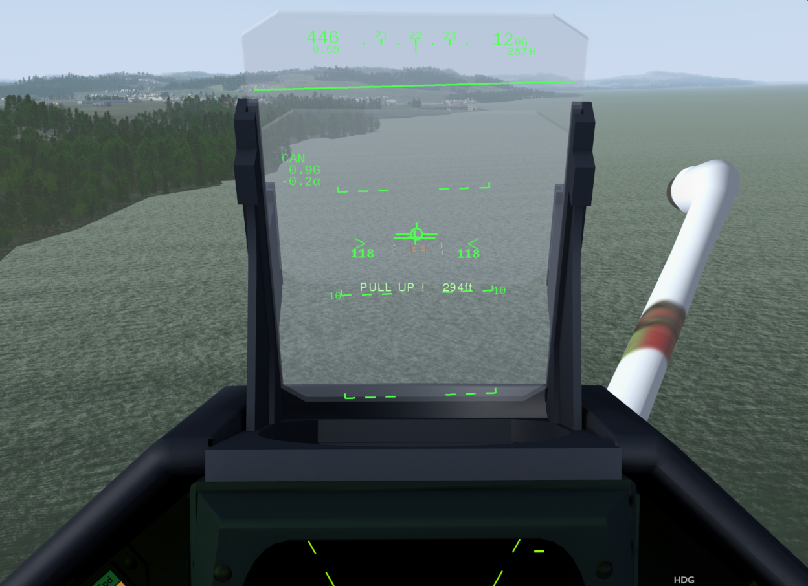

As in real life the target is difficult to see and you need to watch out for your altitude over ground when shooting from a dive.

The following picture illustrates the location relative to landmarks. On the left side within blue colour the military airport of Payerne (``LSMP``) can be seen. Pink shows a break in teh forest along the shore and two marks in the water. Yellow is the location of the water target.

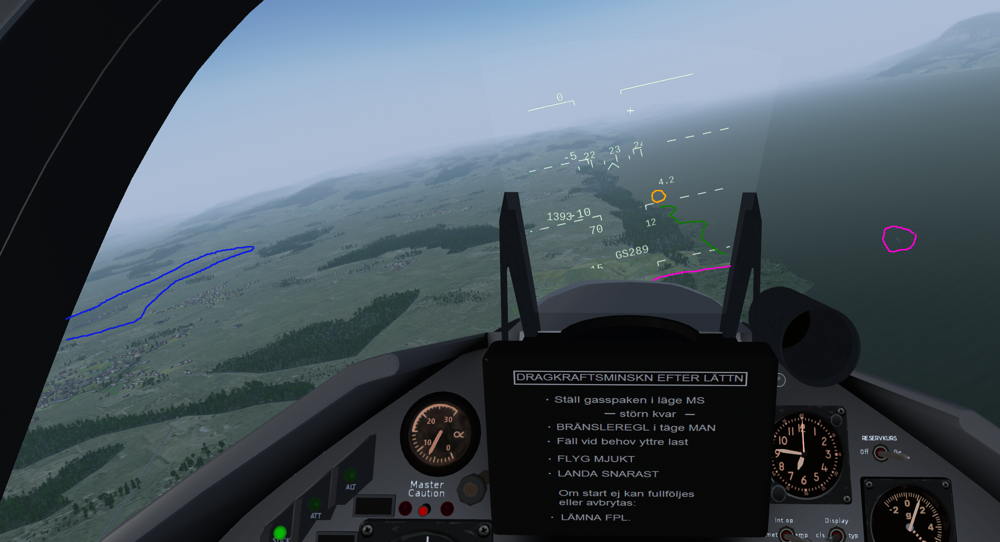

Small And Fast Ground Targets
*****************************

If you fly from ``LSMM`` less than 10 nm South-South-West, then you get to a former military airport ``LSMI``. A truck is driving with up to 100 km/h on the taxiways and the runway in a random pattern.

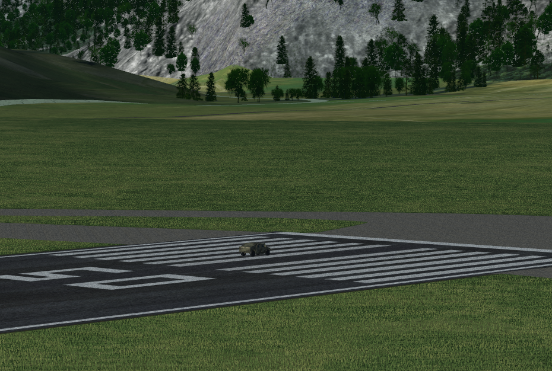

Flying instead North-North-East for ca. 15 nm brings you to a part of Lake Lucerne just at the end of the Runway of ``LSMA``, where a fast speedboat waits to be shot at as a target.

NB: these are not real life situations of the Swiss Air Force. The targets will only get hits but no damage. Challenge yourself by flying without radar or flying low and seek terrain coverage. You might need to fly in fair weather to be able to see the targets.

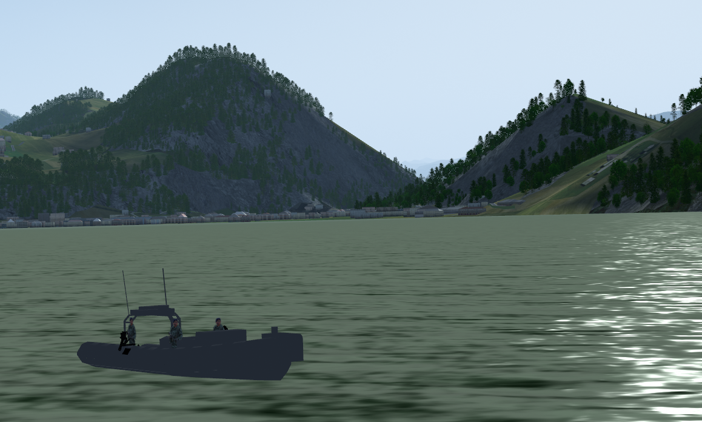

There is a convoy of 3 trucks driving around within ca. 5 km of ``LSMP`` (which is located a few minutes fighter flying west of LSMM). An other convoy of 5 trucks drives on streets along the border of lake ``Murtensee`` a few kilometers north of ``LSMP``.

.. [1] Peter Lewis, 2017: Swiss Tiger - Parallel Flight. Descriptions in German and English on pages 17-19.

.. [2] Olivier Borgeaud, Peter Gunti, 2011: Mirage - Das fliegende Dreieck. Description on page 313 in German.

.. [3] Olivier Borgeauf, Peter Gunti, Peter Lewis, 2010: Hunter - Ein Jäger für die Schweiz. 3D pictures on page 254.

Helicopter Hunting
******************
In the surroundings of the Lake of Lucerne (Vierwaldstättersee) a bunch of low flying helicopters wait to be hunted. The area starts just north of ``LSMM`` up until a bit north of ``LSME``. ``LSZC`` is a previous military airport and a good starting point. The whole area is from 8-8.75 degrees East and 46.75-47.125 North.

Eugen Kvaternik (aka. Croatia)
++++++++++++++++++++++++++++++

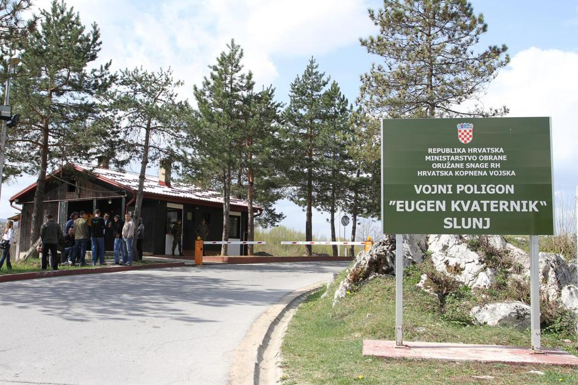

This is a Croatian military shooting range near Slunj. There is a Croatian `wikipedia entry <https://hr.wikipedia.org/wiki/Vojni_poligon_%22Eugen_Kvaternik%22>`_ describing it.

The scenario in Hunter is not a correct representation of the range. Instead the targets have been placed such that they are easy to spot. In the northern side it is easiest to orient oneself with the help of the rivers.

There is a convoy of `Humvees <https://en.wikipedia.org/wiki/Humvee>`_ in a clearing to the West of the town of Slunj. Like the 2 speedboats the trucks are immortal.

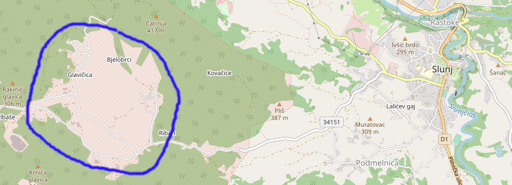

On the opposite side of the shooting range seen from Slunj in direction South-West there is a little ``Blaćansko`` lake/wetland. Cf. the following picture: in the lake there are three targets and to the North-East up the hill are two static targets.

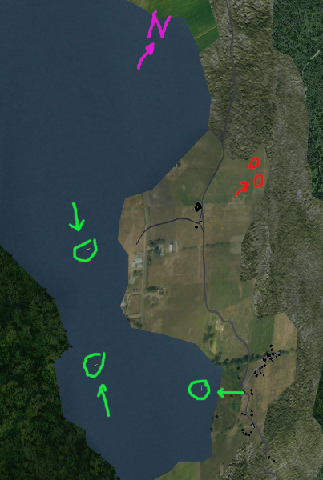

Kornati (Croatia)
+++++++++++++++++

Along the Croatian coast between the island of Krk in the North-West and `Šibenik <https://en.wikipedia.org/wiki/%C5%A0ibenik>`_ in the South-East helicopters and drones are flying low and wait to be hunted down. The scenario has its name from the archipelago of `Kornati <https://en.wikipedia.org/wiki/Kornati>`_.

In addition there are speedboats around the 4 islands ``Prvić``, ``Sveti Grgur``, ``Goli otok`` and ``Rab`` to the South-East of the island of ``Krk``, on which the `Rijeka airport (LDRI) <https://en.wikipedia.org/wiki/Rijeka_Airport>`_ is situated. Alternative airports are the `Aviano Air Base (LIPA) <https://en.wikipedia.org/wiki/Aviano_Air_Base>`_ or `Zadar (LDZD) <https://en.wikipedia.org/wiki/Zadar_Airport>`_.

If a carrier has been announced, then it is situated between the Italian and Croatian coast in the `Adriatic Sea <https://en.wikipedia.org/wiki/Adriatic_Sea>`_.

If a tanker has been announced, then it is departing from ``LIPA``, follows the Italian coast and then flies a pattern ca. between `Rimini <https://en.wikipedia.org/wiki/Rimini>`_ and `Zadar <https://en.wikipedia.org/wiki/Zadar>`_.

Grafenwöhr
++++++++++

The `Grafenwöhr shooting range <https://de.wikipedia.org/wiki/Truppen%C3%BCbungsplatz_Grafenw%C3%B6hr>`_ includes two small airstrips ``ETIC`` and ``ETOI`` with a runway length of ca. 1 km. If you need a longer runway, then ``ETSI`` (`Fliegerhost Ingolstadt/Manching <https://de.wikipedia.org/wiki/Fliegerhorst_Ingolstadt/Manching>`_) or ``ETSN`` (`Fliegerhorst Neuburg <https://de.wikipedia.org/wiki/Fliegerhorst_Neuburg>`_) might be more suitable.

There are lots of static targets as well as a few moving trucks. The positions and types of target are not a direct mapping from reality. This scenario is for ground attack in an not very demanding topography only.

Vidsel
++++++

A scenario at the `Vidsel test range <https://en.wikipedia.org/wiki/Vidsel_Test_Range>`_ next to ``ESPE``. Other notable nearby airports are Jokkmokk (``ESNJ``) and Luleå (``ESPA``).

Targets are located approximately 30nm bearing 330 from ``ESPE``. There are three groups of targets, at ``19.31E,66.40N`` (a few buildings, heavy SAM and AAA), ``19.21E,66.31N`` (target containers, hard shelters, some SAM and AAA), and ``19.47E,66.26N`` (industrial buildings), plus several small gun targets.

There is `custom terrain <https://gitlab.com/colingeniet/ESPE-scenery>`_ available for this scenario.
