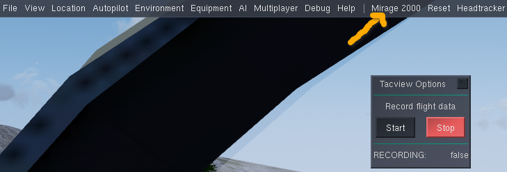
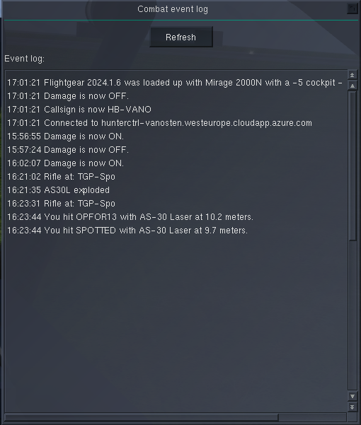
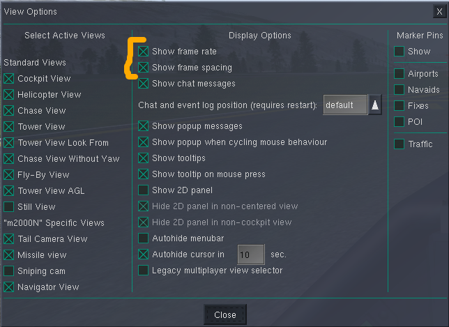
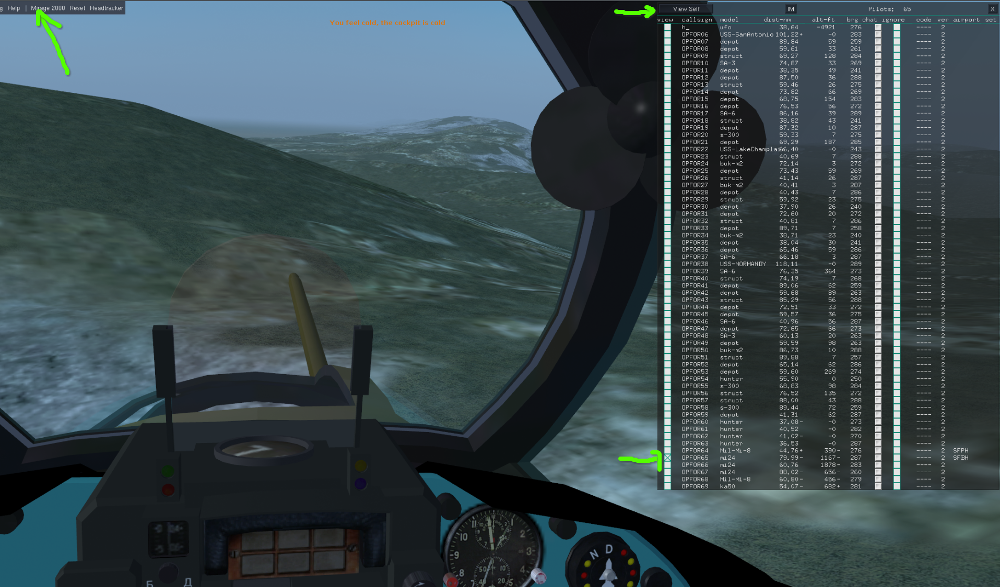

===============
Tips and Tricks
===============

------------------
Know your Aircraft
------------------

This is obvious and universally applicable across (combat) flight simulators. It still holds true:

* Be able to trim the aircraft and use the autopilot. You will need it during weapons preparation (e.g. lock something up with a targeting pod) or during weapons employment (e.g. the `Saab RB 05 <https://en.wikipedia.org/wiki/Saab_RB05>`_ in the `Viggen <https://github.com/NikolaiVChr/flightgear-saab-ja-37-viggen>`_).
* Be able to employ the weapons.
* Train shooting weapons at targets not shooting back, before you try to employ weapons when targets shoot back.

-------------
Retrospective
-------------

After your combat sortie there are different things you can look at to better understand what happened.

.......
Tacview
.......
Most OPRF aircraft allow TacView recordings. E.g. in the Mirage 200 you would go to the ``Mirage 2000`` menu and find ``Tacview``. To see your recording you need the `Tacview <https://www.tacview.net/>`_ software.

................
Combat Event Log
................

Most OPRF aircraft have a built-in combat event log, which is available when standing still on ground. E.g. in the Mirage 2000 you would go to the ``Mirage 2000`` menu and find ``Combat Event Log``. After a flight it might look like the following:

..............
Hunter Web-app
..............

All weapon deployment on Hunter targets having had some sort of impact is displayed in the :ref:`Damage and Hits <web-damage-and-hits-label>` page of the Hunter web-app.

----------
Frame Rate
----------

Your frame rate does matter. The lower the frame rate, the less accurate your missiles, bombs and gun shells will be.

This can be best illustrated with bomb rippling (releasing bombs on a single trigger hold with some spacing). If you fly at ca. 600 kt and have 60 fps, then you can get an accuracy of ca. 5 metres. Or you can get the same accuracy at 300 kt with 30 fps etc. Therefore, if you miss the target it might not be your aiming capabilities but just low frame rate. To get a better frame rate you can play around with `Rendering Options <https://wiki.flightgear.org/Rendering_Options>`_ (or use a less demanding aircraft or a less demanding scenery or ...).

You can enable the frame rate and frame spacing by using the ``View`` menu and then choose ``View Options``. They will then appear at the bottom left (frame spacing) and bottom right (frame rate) of the screen.

--------------------
Take a Target's View
--------------------

In FlightGear the `Pilot List <https://wiki.flightgear.org/Pilot_List>`_ in menu ``Multiplayer`` has a nice feature: you can switch your view to another MP participant's model. In Hunter this means you can switch to e.g. a Shilka and see its turret turn or switch to a helicopter and see it fly through valleys. Remember: you can only see the pilot list if :ref:`MP Damage <mp-damage-label>` is off.

The following example shows the cockpit view of a `Mil Mi-24 <https://en.wikipedia.org/wiki/Mil_Mi-24>`_ (OPFOR65) from within a Mirage 2000. To switch back to your own view, select the button at the top left ``View Self``.

