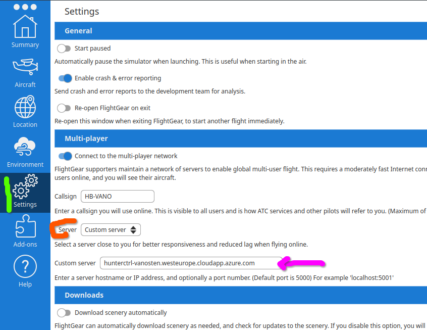
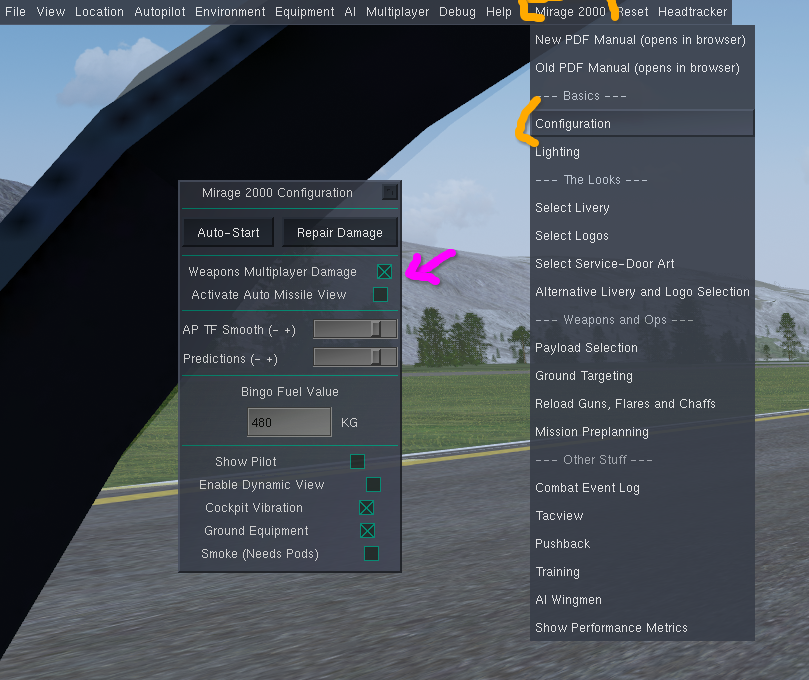
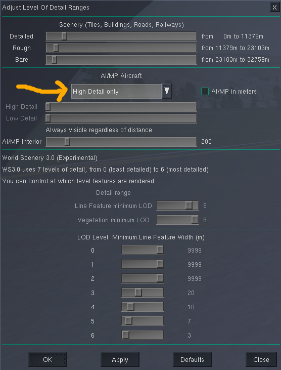

.. _chapter-end-user-requirements-label:

=========================
Preparation before Flying
=========================

NB: most of the content in this chapter is valid for all OPRF interaction - no matter whether Hunter is used or not.

------------
Installation
------------

Nothing has to be installed locally on your machine. I.e. there is no `Nasal⬀ <https://wiki.flightgear.org/Nasal_scripting_language>`_ or `AI⬀ <https://wiki.flightgear.org/AI_Traffic>`_ module to download and install.

Background: Hunter uses FlightGear's `multiplayer⬀ <https://wiki.flightgear.org/Howto:Multiplayer>`_ feature, such that several pilots can see the same targets. All of Hunter's processing is on a remote computer (server).

----------------
Pilot's Aircraft
----------------

In order to be able to see the targets properly, shoot at them and get hits, you need to use a compatible FlightGear aircraft for ``Operation Red Flag (OPRF)`` by going to `OPRF's Discord server⬀ <https://discord.gg/ptVapkE>`_ and check out the list of aircraft in the ``#welcome`` channel. Compatible means here amongst others that the aircraft uses the `Emesary multiplayer bridge for FlightGear⬀ <http://chateau-logic.com/content/emesary-multiplayer-bridge-flightgear>`_.

----------
FlightGear
----------

Use a recent stable FlightGear version (as of 2026 use ``2024.1.x``), which is compatible with the OPRF aircraft. The development version of FlightGear (aka. ``Next``) might not be suitable yet.

---------------------
Download of MP assets
---------------------

You need to have a recent version (optimally latest version) of `OPRF Assets⬀ <https://github.com/l0k1/oprf_assets>`_ and `US Navy Ships⬀ <https://github.com/NikolaiVChr/u.s.navy>`_.

In order to see helicopters and drones, you need the following aircraft:

* `FGAddOn hangar⬀ <https://wiki.flightgear.org/FGAddon>`_ Mil-Mi-24
* `FGAddOn hangar⬀ <https://wiki.flightgear.org/FGAddon>`_ Ka-50
* `Mil Mi-8⬀ <https://github.com/RenanMsV/Mil-Mi-8>`_
* `MQ-9⬀ <https://github.com/JMaverick16/MQ-9>`_

In order to see automated attacking planes or AWACS or an air-refueling tanker, you need the following aircraft:

* `F-15⬀ <https://github.com/Zaretto/fg-aircraft/tree/OPRF>`_
* `F-16⬀ <https://github.com/NikolaiVChr/f16>`_
* `SU-27⬀ <https://github.com/yanes19/SU-27SK>`_
* `MiG-29⬀ <https://github.com/alexeijd/MiG-29_9-12>`_
* `KC-137R⬀ family <https://github.com/JMaverick16/KC-137R>`_

In order to see aircraft carriers:

* MPCarrier from the `FGAddOn hangar⬀ <https://wiki.flightgear.org/FGAddon>`_ (this is a specific FG ``aircraft`` different from the carrier AI scenarios, where the carrier models are available by default).

Only for the Swiss Shooting Ranges scenario, you need additionally the following aircraft:

* `Pilatus PC-9M⬀ <https://sourceforge.net/p/flightgear/fgaddon/HEAD/tree/trunk/Aircraft/PC-9M/>`_

..  `Northrop F-20 Tigershark <https://github.com/JMaverick16/F-20>`_ (simulating the F-5E flown by the Swiss Air Force)

-----------------------
Connecting to MP Server
-----------------------

Unless specified otherwise by the person running Hunter: You need to connect to `OPRF's MP-server⬀ <mpserver.opredflag.com>`_. If in doubt, then look at the `Current Session Information <label-list-sessions>` and look for column ``MP Server Host``. When you are connected, all objects are represented as MP-targets, the same way you would see another player's aircraft.

The easiest way to set the correct multiplayer server is using the FlightGear `Launcher⬀ <https://wiki.flightgear.org/FlightGear_Qt_launcher>`_. As per the following screenshot: you need to choose ``Settings`` and then within the multiplayer area choose ``Custom Server`` and finally specify a MP server.

.. _mp-damage-label:

------------------------------
Enabling MP Damage / Messaging
------------------------------

Hunter uses the same mechanism for damage as OPRF Assets. It means that you need to enable the multiplayer protocol and have MP messaging on.

E.g. in the `Mirage 2000⬀ <https://github.com/5H1N0B11/flightgear-mirage2000>`_ you would choose the configuration dialogue and then tick ``Weapons Multiplayer Damage`` (might look a bit differently in other OPRF aircraft):

NB: toggling MP Damage needs to happen while on the ground!

FYI: when enabling MP messaging, the following happens (depending a bit on the aircraft):

* Your weapons can damage other aircraft / OPRF assets / Hunter targets with MP message on.
* At the same time your aircraft gets signals from other aircraft / OPRF assets / Hunter targets:

  * you get more information in the radar incl. RWR
  * your aircraft can take damage from other's weapons

* `Redout⬀ <https://en.wikipedia.org/wiki/Redout>`_ and `greyout (aka. blackout)⬀ <https://en.wikipedia.org/wiki/Greyout>`_ gets enabled and locked to aircraft settings
* Fuel cannot be frozen
* Traffic is not shown on in-sim map
* Marker pins are disabled
* As soon as no weight on wheels the following dialogues are not available:

  * ``Fuel and Payload``
  * ``System Failures``
  * ``Instrument Failures``

* Aircraft specific dialogues in the aircraft specific menu might not be available: e.g. on the M2000 payload selection and mission preplanning.

-----------------------------
Level of Detail Range Setting
-----------------------------

In Menu ``View`` choose item ``Adjust LOD Ranges`` and make sure that ``High Detail only`` has been selected. Otherwise you might not see targets etc.

