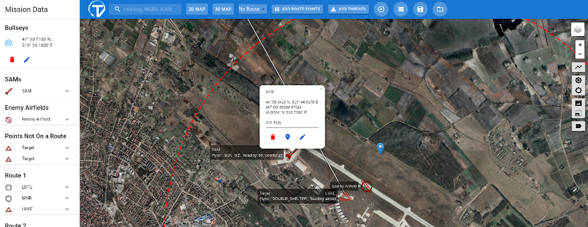
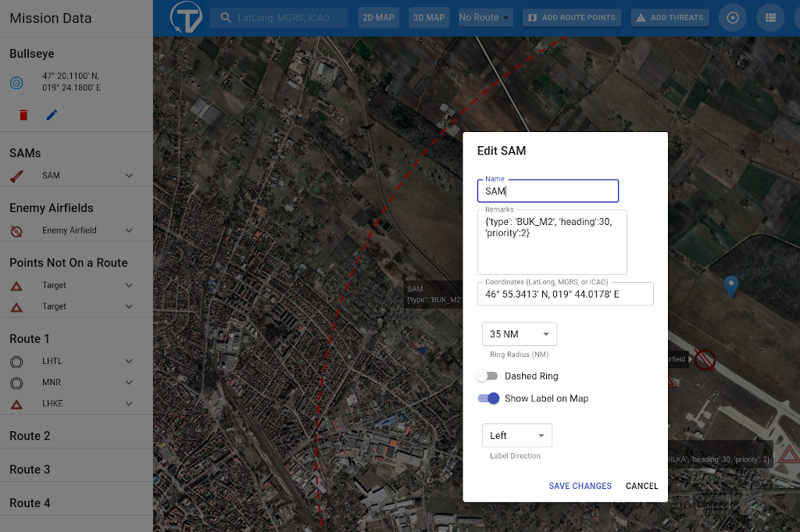

=====================
Creation of Scenarios
=====================

The documentation of the scenario format is in the quite extensive comments in the code: `scenarios.py⬀ <https://gitlab.com/vanosten/hunter/-/blob/master/hunter/scenarios.py>`_. There is no comprehensive graphical user interface to create scenarios on a map like in DCS, BMS Falcon, IL-2 series etc, but ``TronView`` (see below) plus some helpers can get you started.

All scenarios live in a special repository https://gitlab.com/vanosten/hunter-scenarios. Each scenario shall by convention:

* have a file called ``scenario_NAME.py`` (where ``NAME`` is a small letters name, which can have underscore characters but no spaces - e.g. ``scenario_north_norway.py``);
* have a function ``build_scenario()`` which returns a ScenarioContainer object;
* have all other functions named with an underscore at the start (e.g. ``_create_ships_network_XY()``).

----------
Some Hints
----------

* All coordinates are lon/lat (not lat/lon! - Greenwich is ca. at 0.0/51.48).
* It matters that you provide a correct default airport and a correct south-west and north-east corner of the area. The coordinates will primarily be used for the mapping display. However, the creation of networks, digital elevation models etc. should have boundaries within the area of the scenario.
* Have a look at existing scenarios and try to understand - although it is "code", the code being written in Python is readable without programming knowledge.
* Probably the most difficult is defining networks. There are two approaches:
  * **By hand**: Use e.g. the `FlightGear map over scenery models⬀ <https://scenery.flightgear.org/map/>`_ to get coordinates (NB: Hunter's format is lon/lat not lat/lon - and you need to use decimal notation for coordinates). You can use a big screen and semi-transparent paper, draw the outlines, decide on the network nodes and numbering and then on the edges (and in the end keep a photo of it). Using this the encoding (list all nodes, then add all nodes to the network, then connect nodes as edges) gets quite easy. While the manual approach is a bit tedious, it allows to take care of situations, for which the automatic approach using OSM data is not feasible (or gives "wrong" results).
  * **Automatically** using :ref:`Python scripts <chapter-network-creation-label>`.
* Even if you do not understand everything, it helps a lot if you do as much as possible in the given format and first then reach out to the Hunter maintainer to collect the pieces.
* To make convoys or towing (e.g. a plane with a towed target som 500 metres behind) you need to use steps in activation_delay (e.g. 2 seconds between trucks in a convoy; e.g. 500 m / 100 m/s  = 5 secs between tractor and towed object), use the same network and use one of the following: either a DiGraph circle for constant speed moving targets or the same list of destinations for routed trip targets.
* For routed trips:
    * You have to look at a `OpenStreetMap⬀ <https://www.openstreetmap.org/#map=7/56.188/11.617>`_ and make sure that the network of roads actually allows to go from the origin to the sequence of destinations. If a path cannot be found, then the target just does not move and a warning is written to the log. But you know that only while executing - there is no ahead of time validation currently.
    * The smaller the network, the better for CPU and RAM usage.

----------------------------
Tools for Creating Scenarios
----------------------------

NB: When you use the tools for the first time, it might look at bit complicated. Therefore, it might be easier to connect with the maintainer of Hunter the first time to run the scripts for you or with you.

Digital Elevation Model for Visibility
++++++++++++++++++++++++++++++++++++++

For global visibility of the Hunter targets you need to generate a digital elevation model (DEM) - otherwise ships, Shilkas and other shooting assets will not respect line of sight restrictions by the Earth's curvature or bumpy terrain. The Python module is available in ``hunter/scenario_tools/dem_grid.py``.

There are specific parameters ``dem_south_west`` and ``dem_north_east`` in the scenario definition. If they are not used, then the grid is based on the default extent for the scenario (``south_west`` and ``north_east``). You want the DEM to be at maximum cover the are of the scenario - and at least cover the networks plus any static shooting target.

Calculating the DEM takes a lot of time (e.g. the Croatia scenario takes ca. 1 day for ca. 9 mio points) and uses RAM for each target needing a DEM (shooters or targets dispensing counter measures). Therefore, some thought should be given to define the grid boundary.

.. _chapter-network-creation-label:

Network Creation for Moving Targets
+++++++++++++++++++++++++++++++++++

All moving targets (e.g. ships, helicopters) need a precalculated network, which is used to find points of interest (targets randomly find start points and end points) and then move along the network edges in horizontal and vertical direction.

Directory ``hunter/scenario_tools`` includes some Python modules, which help generating networks for vehicles, helicopters and ships (one module per type). Each module has its own main method, which needs to be called with a specific parameter set (read the code documentation for the main method to find out which parameters).

There are some prerequisites:

* You need `osm2city⬀ <https://gitlab.com/osm2city/osm2city>`_. It has to be the `ws3⬀ <https://gitlab.com/osm2city/osm2city/-/tree/ws3?ref_type=heads>`_ branch.
* You need to know how to run ``osm2city`` - read its `documentation⬀ <https://osm2city.readthedocs.io/en/latest/>`_.
* You have to install the required Python module requirements needed by osm2city. ``requirements_scenario_tools.txt`` should list them.
* Depending on the generating module you need to have the FG scenery installed.
* You need a minimal ``params.py`` file.
* You need to be aware of the working directory, so you know where the files are going to be written to.
* Make sure that the extent of the network is smaller than or the same as the scenario area.
* Make sure the DEM covers the network area - unless you do not need visibility calculations (e.g. nothing shooting or everything at MSL (mean sea level)).

Once you have correctly run the modules (which can take many minutes!), you need to make sure to update the scenario definition with the correct file names - and include the files in `Hunter scenarios⬀ <https://gitlab.com/vanosten/hunter-scenarios>`_. Please make sure to use a decent naming convention including the scenario name for your files.

Creating Scenarios with TronView
++++++++++++++++++++++++++++++++

`TronView⬀ <https://viperops.com>`_ is an online combat oriented flight planning software. It has it's limitations (no radio database, only US/USAF
ICAO airports) but it has many features that make it practical to create a scenario in - currently only supporting static targets as per Hunter.

The rules for setting up the scenarios:

* Targets must not be part of routes (Routes in TronView are used to plan flights an can be exported to .fgfp with `a conversion script⬀ <https://github.com/Rudolf339/usefullstuff/blob/master/tronview2fgfp.py>`_).
* Metadata for targets are written in the ``Remarks`` field, with a specific syntax (see picture) - brackets, commas, colons etc. are important! The possible entries are all based on the Hunter definition of static targets:

  - ``heading``: Heading of the target, defaults to 0.
  - ``type``: type of the target. See options in `mp_targets.py⬀ <https://gitlab.com/vanosten/hunter/-/blob/master/hunter/mp_targets.py>`_ - ca. lines 130-170. Defaults to DEPOT.
  - ``priority``: missile priority, defaults to 0.
* It's a good convention to put the SAMs with the option ``ADD THREATS -> SAM``, but they work as regular target points as well.

After having opened the website either zoom out, navigate and zoom in on your area of choice or use the search field on the left side of the blue top bar. Search might not get you any results if the area is not close to an US/USAF airport. Add threats by using the button in the top blue bar.

After pressing the edit symbol, you can change the name and you must edit the ``Remarks`` field. E.g. ``{'type': 'BUK_M2', 'heading': 30, 'priority': 2}``

When you are done, you need to save the file. It will look similar to the example ``TronView_kecskemet.txt`` in the ``utilities`` directory in the scenario repository (you can also open that file in TronView to have a look first).

In order to actually generate a scenario file in the Hunter specific format, you need to run ``tron2scenario.py`` situated in the ``utilities`` directory in the scenario repository. For that to work, your Python environment must be set up correctly including ``hunter`` and ``osm2city``.

NB: this way of creating scenarios has not been maintained and might not work.
