===============
Web-application
===============

Hunter has a simple web-ui at `mango-meadow-0bc8d0703.5.azurestaticapps.net <https://mango-meadow-0bc8d0703.5.azurestaticapps.net/>`_ showing damage statistics, a map of airports, a map of targets as well as a list of targets. The data for different sessions is kept for some days.

------------
Page Refresh
------------

You need to press the ``Refresh`` button on the page to get the newest data. This is on purpose, because otherwise it can get tricky to interact with information of moving targets on maps and lists. Right beside the button you can see when data has been last fetched (in UTC timezone).

------
Tables
------

Tables can be sorted by clicking on the column header. the content can be filtered by using the field below the table header.

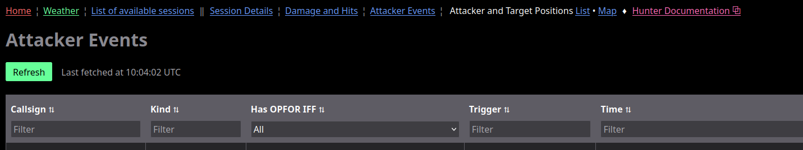

-------------
Response Time
-------------

To save cost the web-site backend hibernates, when it is not used. Therefore, if you are the first to use it for a while, it might take tens of seconds to load.

.. _chapter-true-label:

-------------------------
True vs. Magnetic Heading
-------------------------

All course/heading numbers are in degrees and will always be true heading. Depending on the pilot's aircraft the `Heading Indicator <https://en.wikipedia.org/wiki/Heading_indicator>`_ can be set to show `True North <https://en.wikipedia.org/wiki/True_north>`_. You can get the local magnetic variation in FlightGear by using ``Equipment`` -> ``Instrument Settings``.

----------
Navigation
----------

Navigation between pages is at the top. When no session has been chosen, then only few menu items are shown.

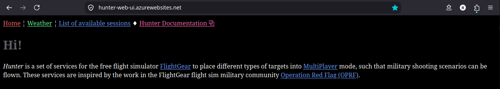

As soon as a session has been chosen, then additional menu items are shown.

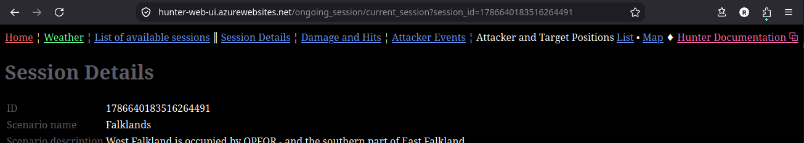

-----------
Screen Size
-----------

The content is optimized for viewing on computer screens or tablets. There might be visual residuals on small screens like phones.

---------------------
Session Related Pages
---------------------

..........................
List of Available Sessions
..........................

A "session" is one run of Hunter with a specific scenario. The page lists sessions occurred within the last 30 days (after data data gets deleted). Clicking on the ID in the lest most column leads to the details about the session.

NB:

* The operator running Hunter needs to enable writing the data to the database using the ``-x`` :ref:`command line argument for running Hunter <chapter-cli-label>`.
* The operator running Hunter can choose to hide a session in the overview using argument ``-n``. This can be done during an event to not show the map etc. The operator can after the event then tell the ID to allow viewing the results.

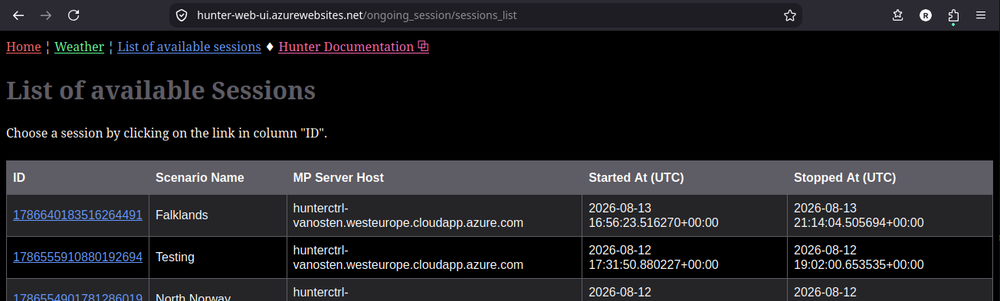

...............
Session Details
...............

This page show amongst others which MP server to use and which target types are shooting and how. The "typical airport" is part of the Hunter :ref:`scenario <scenario-label>` definition - but depending on shooting targets nearby you might want to choose another airport.

The map gives an overview of the area including airports available in FlightGear. You can click on the labels to see some details about the airport.

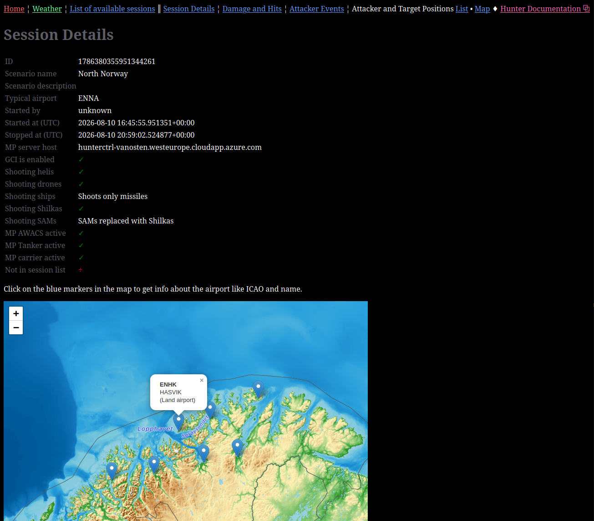

.. _web-damage-and-hits-label:

...............
Damage And Hits
...............

Shows the result of damage employment on Hunter targets - if there was any damage. It does not show the results of damage on virtual pilots by shooting Hunter targets or other virtual pilots (NB: :ref:`Conduct <conduct-label>`).

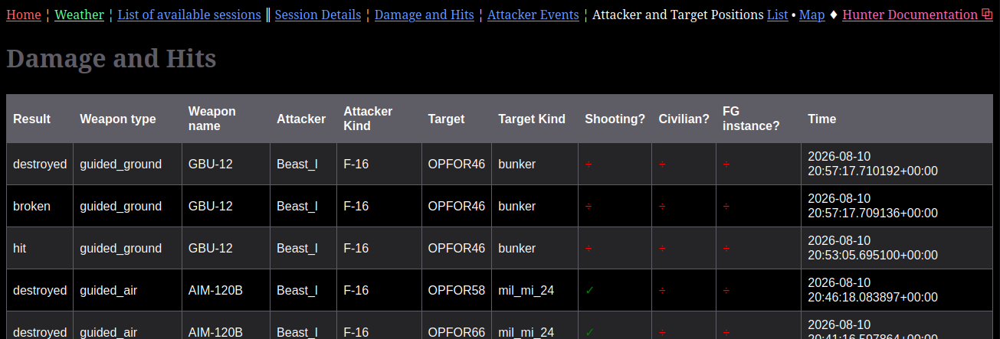

.. _web-attacker-events-label:

...............
Attacker Events
...............

Shows which virtual pilots have joined with which callsign and what :ref:`IFF <iff-label>` setting.

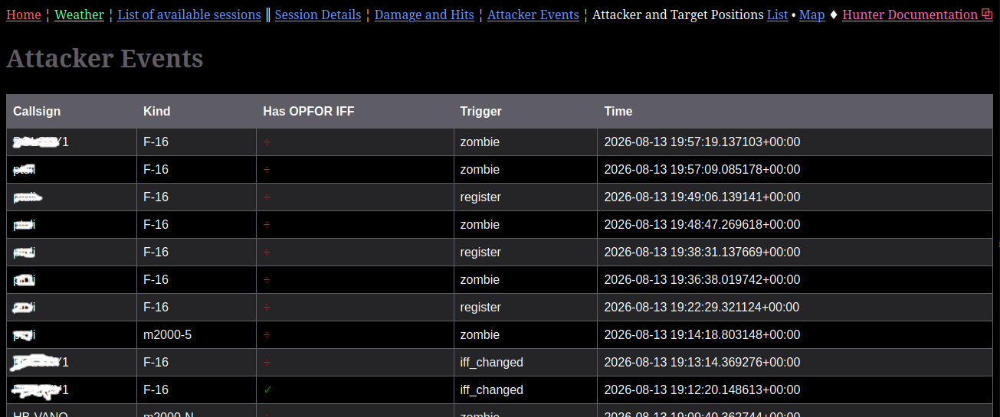

.. _web-missile-events-label:

...............
Missiles Events
...............

Shows missiles shot by simulated targets for debugging and to prevent some cheating.

.....................................
List of Attacker and Target Positions
.....................................

Shows the positions etc. of virtual pilots and targets either with data refreshed every max. 30 seconds for ongoing sessions - or the last refresh for finished sessions.

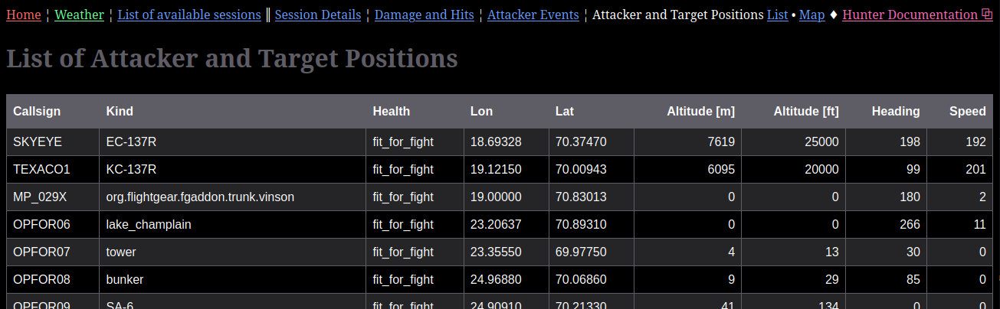

....................................
Map of Attacker and Target Positions
....................................

Ditto as a map. As you zoom in and click on targets you can get additional information. Also clicking somewhere on the map shows the lon/lat of the clicked point on the bottom left side of the map.

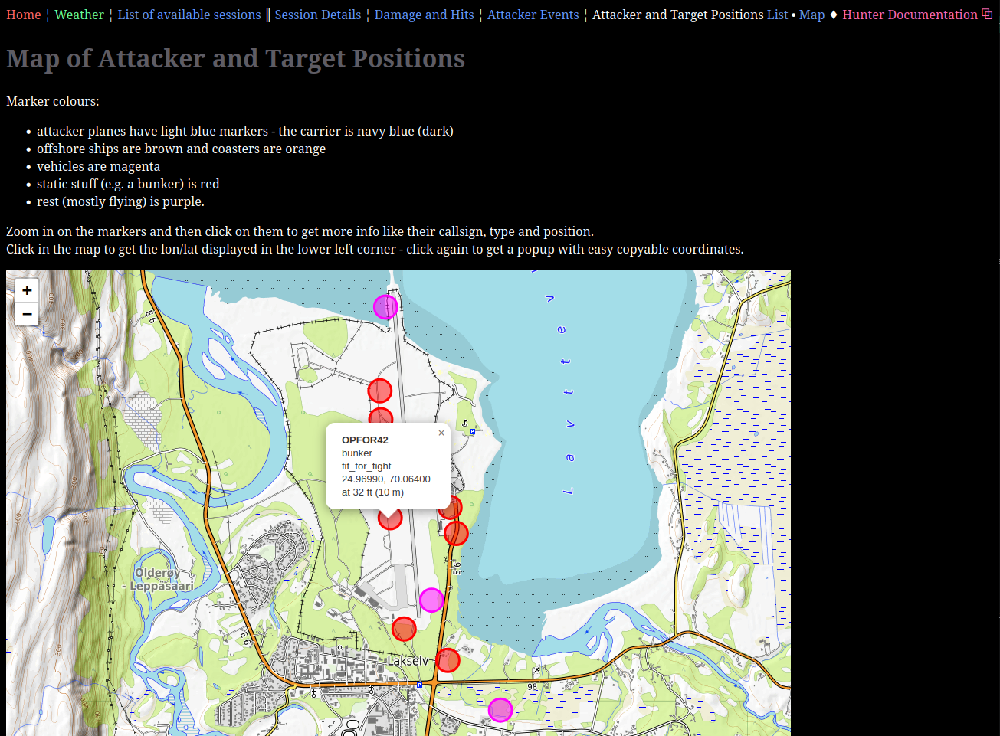

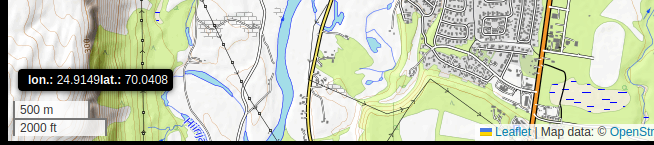

-------
Weather
-------

This allows you to do some calculations useful for mission planning, e.g. for the FlightGear Viggen.

NB:

* The data are fetched live and not from your FlightGear configuration.
* The forms are typically used sequentially - but the second form can also be used directly with data from FlightGear.

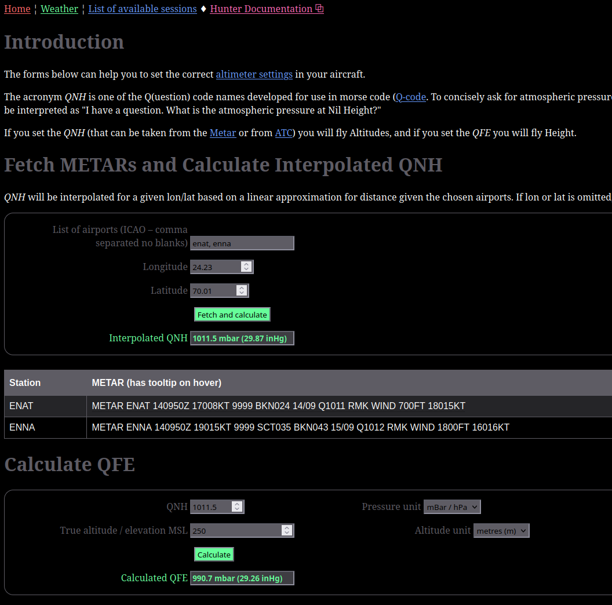
